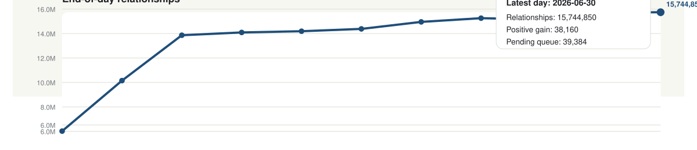
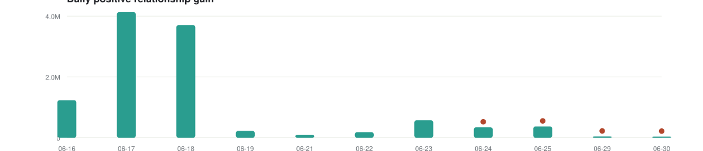
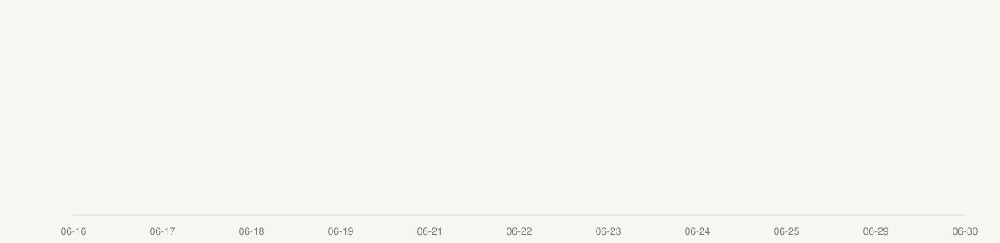

# ExplainRx Crawl Growth

Minimal public snapshot of ExplainRx KB expansion progress.

[Open the full combined plot](docs/metrics/crawl_daily_growth.svg)

Click any panel to open it full size.

<table>
  <tr>
    <td align="center" width="50%">
      
       
      Edges in KB
    </td>
    <td align="center" width="50%">
      
       
      Daily positive relationship gain
    </td>
  </tr>
  <tr>
    <td align="center" width="50%">
      
       
      End-of-day pending queue
    </td>
    <td align="center" width="50%">
      
       
      Entities completed
    </td>
  </tr>
  <tr>
    <td align="center" colspan="2">
      
       
      Entities in KB total
    </td>
  </tr>
</table>
