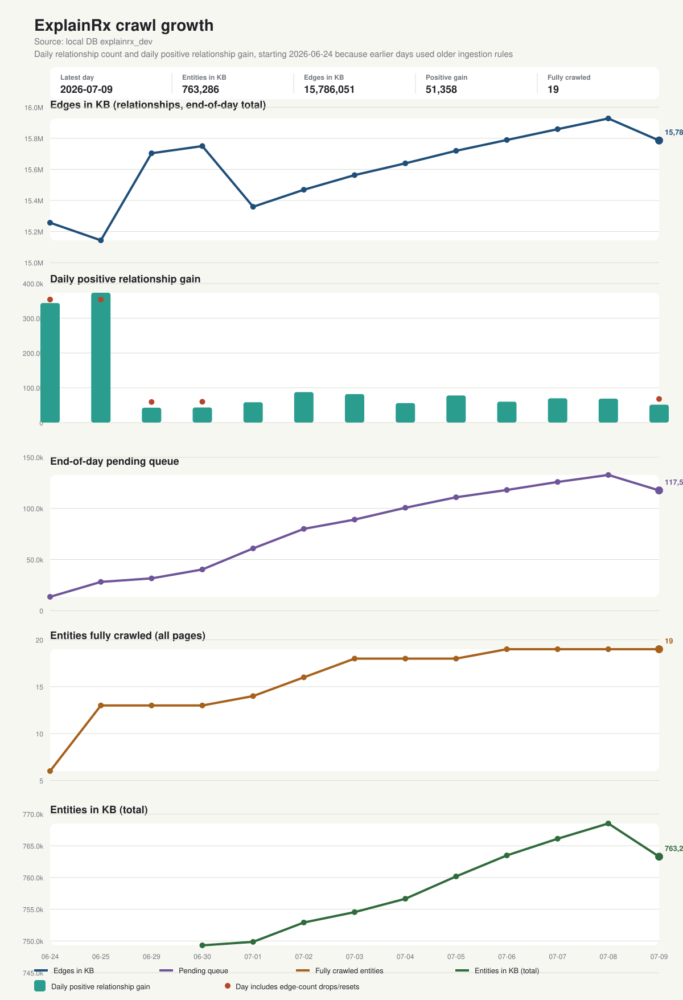

# ExplainRx crawl daily summary

Latest rollup day: **2026-07-14**

Source: **shared Pi crawl via agnes@192.168.1.21**

Display baseline: **2026-06-24 onward**. Earlier days are excluded because they used older ingestion rules.

## Latest day

- Snapshot window: `2026-07-14T18:30:12+02:00` to `2026-07-14T23:45:47+02:00` local (`63` snapshots)
- Entities in KB: `773,474` (`+249` today)
- Relationships in KB: `16,098,404` (positive gain `+8,986`, net `+8,986`)
- Completed entities (all pages crawled): `152` (`+0` today)
- Queue: `done 21 (+0)`, `processing 4 (-6)`, `pending 145,993 (+725)`, `errors 0 (+0)`
- Relationship drop/reset events recorded today: `0`

## Recent days

| Date | Edges in KB | Positive gain | Entities in KB | Completed | Pending | Notes |
|---|---:|---:|---:|---:|---:|---|
| 2026-07-14 | 16,098,404 | +8,986 | 773,474 | 152 | 145,993 |  |
| 2026-07-10 | 16,089,418 | +55,652 | 773,225 | 152 | 145,262 |  |
| 2026-07-09 | 16,033,766 | +103,603 | 771,900 | 152 | 140,976 |  |
| 2026-07-08 | 15,927,736 | +68,785 | 768,515 | 151 | 132,685 |  |
| 2026-07-07 | 15,858,951 | +69,822 | 766,113 | 151 | 125,817 |  |
| 2026-07-06 | 15,789,129 | +60,178 | 763,482 | 151 | 117,995 |  |
| 2026-07-05 | 15,719,565 | +77,945 | 760,170 | 151 | 110,827 |  |

Generated from `crawl_daily_progress.csv`.
